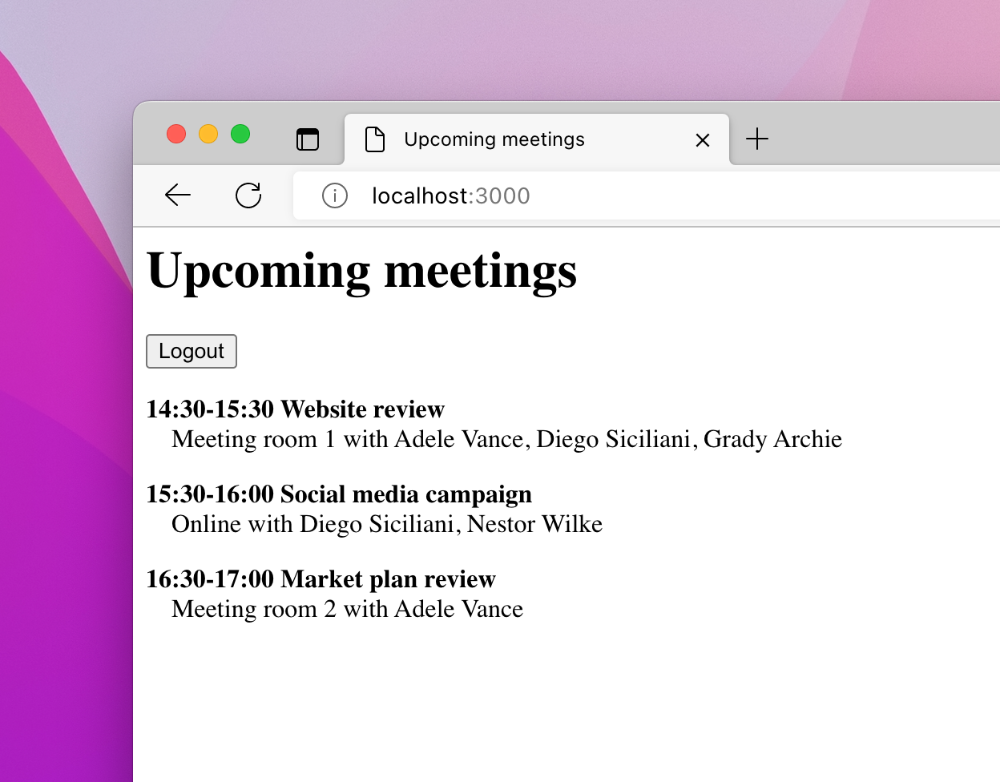

# Sample single page application showing upcoming meetings for a Microsoft 365 user

This repo contains a sample single page application (SPA) that shows how to get upcoming meetings of the current user from Microsoft 365.

## Prerequisites

- [Node.js LTS](https://nodejs.org)
- Microsoft 365 developer tenant, you can get it for free through the [Microsoft 365 developer program](https://developer.microsoft.com/microsoft-365/dev-program?WT.mc_id=m365-79477-wmastyka)

## Minimal path to awesome

1. Clone the repo
1. Change the working directory to the repo folder
1. Start terminal, change the working directory to the repo folder and run: `chmod +x setup.sh`
1. Run the setup script: `./setup.sh`
1. Start the development server: `npx lite-server`
1. In your web browser open `http://localhost:3000/index.html`

## Concepts introduced in this sample

- Retrieving upcoming meetings for today from the Microsoft 365 calendar with the [Microsoft Graph JS SDK](https://learn.microsoft.com/graph/sdks/sdk-installation#install-the-microsoft-graph-javascript-sdk?WT.mc_id=m365-79477-wmastyka)
- Facilitate authentication and authorization using [MSAL.js](https://learn.microsoft.com/azure/active-directory/develop/msal-overview?WT.mc_id=m365-79477-wmastyka)
- Signing in users with the [MSAL.js redirect flow](https://learn.microsoft.com/azure/active-directory/develop/scenario-spa-sign-in?tabs=javascript2&WT.mc_id=m365-79477-wmastyka)
- Registering a new Azure AD application for a single page app using [CLI for Microsoft 365](https://aka.ms/cli-m365)
